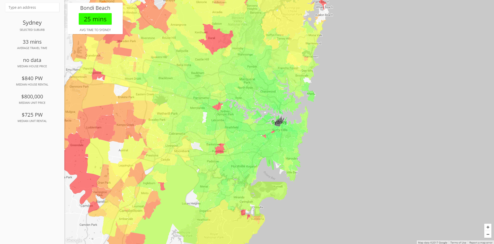

# Facebook Sydney Hackathon 2017 Data

We competed in Facebook's Sydney Hackathon 2017 and delivered a web application for viewing the suburbs in Sydney with the best access to public transport.
Here is the data that we mined from Sydney Trains for the Hackathon.

The data was mined using a Golang script that filled out all of the combinations of suburbs to suburbs.
Data was stored in a Cassandra cluster, and for the final web application was served out of Redis to ensure it was fast.

We came 3rd overall.

